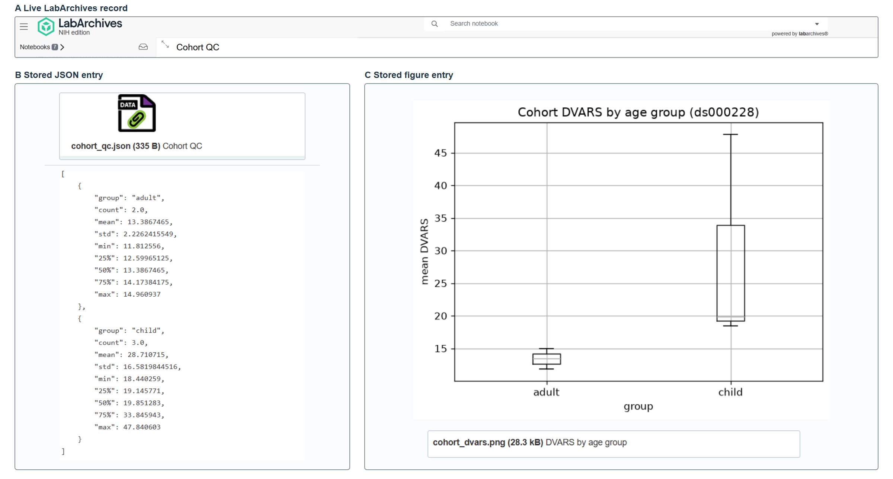

<!--
JORS software metapaper skeleton. Section order and headings follow the JORS
Word template (v0.2). Every open item is marked TODO. Build from this
directory with:

  pandoc paper.md --citeproc --bibliography ../paper.bib --csl vancouver.csl -o paper.docx

Vancouver CSL: https://github.com/citation-style-language/styles/blob/master/vancouver.csl
-->

# (1) Overview

## Paper Authors

1. Li, Christoph (corresponding author, christoph.li@nih.gov, ORCID 0009-0009-4624-2578)
2. Lawrimore, Josh (ORCID 0000-0003-2301-9073)
3. Moraczewski, Dustin (ORCID 0000-0002-0422-3135)
4. Thomas, Adam G. (ORCID 0000-0002-2850-1419)

## Paper Author Roles and Affiliations

1. Software, Writing – original draft. Data Science and Sharing Team, National
   Institute of Mental Health, National Institutes of Health, Bethesda, MD, USA.
2. Conceptualization, Software, Writing – review & editing. Clinical Monitoring
   Research Program Directorate, Frederick National Laboratory for Cancer
   Research, Frederick, MD, USA.
3. Supervision, Writing – review & editing. Data Science and Sharing Team,
   National Institute of Mental Health, National Institutes of Health,
   Bethesda, MD, USA.
4. Supervision, Writing – review & editing. Data Science and Sharing Team,
   National Institute of Mental Health, National Institutes of Health,
   Bethesda, MD, USA.

## Abstract

<!-- TODO: cut to about 100 words for a non-expert reader (JORS template). The
JOSS Summary below is the starting point and is about 150 words. -->

`labapi` is a Python library that enables computational workflows to connect
to the LabArchives electronic lab notebook (ELN). Without an API connection,
researchers must manually add workflow outputs through the LabArchives web
interface, navigating to the appropriate page and uploading each output so
that it appears with the experimental notes that provide context. `labapi`
translates the flat LabArchives API into a Python object model following the
hierarchy of the web interface, allowing workflows to navigate and modify
notebook content through familiar paths, so that pipelines can both read from
and write to the laboratory record automatically.

## Keywords

electronic lab notebook; LabArchives; research data management;
reproducibility; Python; API client

<!-- TODO: confirm keyword set with co-authors. -->

## Introduction

NIH intramural policy requires new research to be documented in an approved
electronic notebook, and LabArchives is one approved option [@nih_eln_policy].
LabArchives is also used by academic and other research organizations outside
NIH [@labarchives]. Once uploaded to LabArchives, an output becomes part of
the laboratory record beside the notes and revision history that document the
experiment [@labarchives].

When a pipeline produces an output to be recorded after every run, using the
web interface requires the researcher to return to the appropriate page each
time. Researchers can automate that transfer through the LabArchives web API,
but doing so requires custom integration code. Researchers navigate the web
interface by notebook path; API calls require an internal identifier for each
page. Code using the API directly must resolve the path to that identifier and
construct the requests that read or write the page [@labarchives_api].
`labapi` performs this work so that researchers can configure workflows with
notebook paths. The authors develop two applications built on `labapi` that
other NIMH intramural laboratories use in their research: `muronto` records
neuro-behavioral experiment outputs, while `save-my-jupyter` deposits Jupyter
notebook snapshots [@muronto; @save_my_jupyter]. The intended users are
computational researchers and research software developers working in or with
experimental laboratories that use LabArchives.

### Comparison with similar software

<!-- JORS requires "a short comparison with software that implements similar
functionality" inside the Introduction. Reused from the JOSS "State of the
field" section. TODO: re-check each row and update the checked date before
submission. -->

Benchling, RSpace, and eLabFTW pair their APIs with official client libraries
[@benchling_sdk; @rspace_client; @elabapi_python]. LabArchives publishes its
API without a public official client library. The standalone LabArchives
alternatives in Table 1 do not combine path navigation, entry handling, and
attachment transfer in a single client [@labarchives_api].

| Project | What it provides | Navigable notebook objects |
|---|---|---|
| `labapi` | General Python client | Yes |
| `labarchives-py` [@mcmero] | Signed generic GET-call wrapper | No |
| `labarchives-js` [@marcellofuschi] | Login, image-entry search, and attachment-URL helpers | No |
| `labarchives-client` [@alaninmcr] | Unmaintained: no released functionality | No |

: Table 1. Standalone public LabArchives clients, checked 20 August 2026.

Among these, `labarchives-py` comes closest. Its single-module implementation
signs arbitrary GET requests and returns raw responses, leaving researchers to
choose endpoints, parse responses, and implement notebook navigation, entry
handling, and file-transfer helpers. Extending it would still have required
building the notebook model and higher-level record operations, so `labapi`
was developed as a separate client. Specialized ReDBox and MCP integrations
also exist, but neither provides a general-purpose, path-oriented Python
notebook object interface [@redbox_labarchives; @labarchives_mcp].

## Implementation and architecture

`labapi` was designed to simplify working with the LabArchives API and make it
familiar to users of the web interface. To provide this familiarity, `labapi`
represents the notebook hierarchy shown in the web interface as Python
objects. Moving through this hierarchy is essential to working with a
notebook, but difficult through the LabArchives API. Helpers such as `dir()`
and `page()` ensure that directories and pages exist at a path, retrieving
matching nodes or creating missing nodes and parent directories, while
`traverse()` resolves only existing paths (Figure 1).

{width=64%}

<!-- TODO: export object-model.svg to a 300 dpi PNG for the .docx build and
point the image at it. -->

The design follows the maxim "Parse, don't validate" [@king2019parse].
`labapi` parses escaped notebook-path strings into canonical `NotebookPath`
objects that preserve segment and absolute/relative semantics for
composition, resolution, containment, and tree traversal.

`create_json_entry()` stores JSON as an attachment for reuse by code and adds
a formatted preview for review in the web interface. A library-level
meta-entry was considered, but it would break the direct correspondence
between `labapi` objects and native LabArchives entries. Preserving the
grouping for other tools would then require additional bookkeeping entries,
so richer metadata schemes were left to higher-level applications.

Applications built on `labapi` may also need to serve more than one
researcher. API credentials are therefore held in a `Client`, separate from
each `User` session, so a centralized application can retain multiple
sessions without distributing the credentials.

<!-- TODO: JORS readers expect a short paragraph on the module layout:
client (HMAC-SHA512 signing, api_get/api_post), user session, tree
(Notebook -> NotebookDirectory -> NotebookPage), entry types, util/extract
(lxml XML helpers). One paragraph, no code. -->

## Quality control

<!-- TODO: JORS asks for the level of testing and for "examples of running the
software with sample input and output data". Fill in from the repository:
- unit tests in tests/ using MockClient, run by pytest with coverage
- opt-in live integration tests (pytest --integration) against a LabArchives
  account
- GitHub Actions on every push and pull request across Python 3.10-3.14
  (unit tests, Ruff lint and format, pyright/ty type checking, Sphinx docs
  build); integration tests run on manual dispatch
- state where sample input and output live (examples/csv_table/sample_data.csv,
  examples/json_sync/sample_data, or paper/jors/sample/) -->

The repository includes credential-free unit tests, opt-in live integration
tests, and end-to-end examples with sample data.

### Sample run

<!-- Reused from the JOSS "Example workflow" section. TODO: name the sample
input files and the expected output, and keep the listing short. -->

In this example, a researcher adds `labapi` to a two-stage quality-control
workflow using five subjects from the public OpenNeuro dataset `ds000228`
[@ds000228]. The listings use `subjects` as a placeholder for the five
subject identifiers and `compute_qc()` and `summarize()` as placeholders for
scientific calculations, so only the LabArchives interaction is shown.
During the first stage, the workflow writes a group label and mean DVARS, a
functional MRI quality-control value [@power2012dvars], for each subject to
LabArchives. The second stage reads the stored values back and produces a
cohort summary.

The first stage uses an existing notebook named `Lab QC`, creates or reuses
subject pages under `Partly Cloudy QC`, and writes each subject's data as a
JSON attachment with a formatted preview.

```python
user = labapi.Client().default_authenticate()
qc = user.notebooks["Lab QC"].dir("Partly Cloudy QC")

for subject in subjects:
    qc.page(f"sub-{subject}").entries.create_json_entry(compute_qc(subject))
```

The second stage opens the existing folder with `traverse()`, loads the first
entry from every subject page, and writes the summary and a figure to the
`Dashboards/Cohort QC` page.

```python
notebook = user.notebooks["Lab QC"]
qc = notebook.traverse("Partly Cloudy QC")
records = [json.load(page.entries[0].content) for page in qc.children]

summary, figure_path = summarize(records)
dashboard = notebook.page("Dashboards/Cohort QC")
dashboard.entries.create_json_entry(summary)

attachment = labapi.Attachment.from_file(figure_path)
dashboard.entries.create(labapi.AttachmentEntry, attachment)
```

The resulting LabArchives page is shown in Figure 2.



# (2) Availability

## Operating system

<!-- TODO: CI runs on ubuntu-latest only. Either state Linux as tested and
macOS/Windows as supported but untested, or add an OS matrix first. -->

Cross-platform (pure Python). Continuous integration runs on Ubuntu Linux;
the library is used on Windows and macOS.

## Programming language

Python 3.10 or later (tested on 3.10 through 3.14).

## Additional system requirements

Network access to a LabArchives API endpoint and API credentials (Access Key
ID and password) issued by LabArchives. The optional browser-based login flow
requires a locally installed Chrome, Firefox, or Edge.

## Dependencies

Required: `cryptography` (>= 50), `lxml` (>= 6.1.1), `requests` (>= 2.33),
`typing-extensions`. Optional extras: `labapi[builtin-auth]` adds `selenium`
and `installed-browsers` for the browser login flow; `labapi[dotenv]` adds
`python-dotenv` for loading credentials from a `.env` file.

## List of contributors

Christoph Li (lead developer and maintainer), Josh Lawrimore (concept, code,
review), Adam G. Thomas (code), Dustin Moraczewski (project direction).

<!-- TODO: confirm with co-authors; the list is optional in the template. -->

## Software location

**Archive**

- Name: Zenodo
- Persistent identifier: <https://doi.org/10.5281/zenodo.22021367>
  <!-- TODO: replace if a 1.2.x patch release is cut for the submission. -->
- Licence: MIT
- Publisher: Christoph Li
- Version published: 1.2.0
- Date published: 20 August 2026

**Code repository**

- Name: GitHub
- Identifier: <https://github.com/nimh-dsst/labapi>
- Licence: MIT
- Date published: 15 December 2025 <!-- TODO: confirm first public date. -->

Also distributed on PyPI: <https://pypi.org/project/labapi/>. Documentation:
<https://nimh-dsst.github.io/labapi/>.

## Language

English

# (3) Reuse potential

<!-- TODO: JORS requires "details of what support mechanisms are in place".
Rewrite around reuse rather than impact:
- who can reuse it: any lab or core facility on LabArchives, any RSE building
  a pipeline that must deposit into the record, ELN backup and migration tools
- how it is extended: applications layered on the object model (muronto,
  save-my-jupyter), the entry-type hierarchy, path composition
- support: GitHub issue tracker, CONTRIBUTING.md, versioned docs on GitHub
  Pages, releases on PyPI and Zenodo, named maintainer, dependabot
- limits: bound to the LabArchives API surface; institutional API keys needed -->

`labapi` underpins laboratory record-keeping tools in use beyond the authors'
team, including the `muronto` and `save-my-jupyter` applications described
above [@muronto; @save_my_jupyter]. The library's notebook-backup support was
developed in coordination with the Systems Neuroscience Imaging Resource
(SNIR), a core facility providing imaging and image-analysis support to NIMH
intramural investigators, which uses `labapi` to automate backups of its
LabArchives notebooks [@labapi_issue_264]. NIH policy requires intramural
researchers to use an approved electronic notebook for new research
[@nih_eln_policy], and LabArchives publishes no official client library;
`labapi` fills that gap for laboratories that need to automate this
record-keeping.

Support is provided through the GitHub issue tracker; contributions follow
the repository's contributing guide. <!-- TODO: expand. -->

# Generative AI use

<!-- Ubiquity Press AI policy (Nov 2025): any use beyond copyediting must be
declared. Reused from the JOSS disclosure; TODO: re-read the policy page and
adjust placement or wording if it prescribes a location. -->

The authors designed `labapi`'s foundational architecture and implemented its
core. Generative AI subsequently assisted with development, testing,
maintenance, release work, project documentation, and manuscript preparation.
It generated code, contributed to tests, opened pull requests and issues, and
drafted and edited documentation and manuscript text. The authors retain
final control over the software's scope, behavior, and public interface and
take responsibility for the software and manuscript. They reviewed and
accepted AI-assisted changes through public pull requests and reviewed and
revised all AI-assisted manuscript text. Tools: Anthropic's Claude (Opus 4.6,
Opus 4.8, Opus 5, Sonnet 4.6, Sonnet 5, and Fable 5) and OpenAI's Codex
(GPT-5.4, GPT-5.5, and GPT-5.6 Luna, Sol, and Terra), the latter accessed
through the HHS Enterprise agreement.

# Acknowledgements

The contributions of the NIH author(s) were made as part of their official
duties as NIH federal employees, are in compliance with agency policy
requirements, and are considered Works of the United States Government. The
findings and conclusions presented in this paper are those of the author(s)
and do not necessarily reflect the views of the NIH or the U.S. Department of
Health and Human Services (HHS). The content of this publication does not
necessarily reflect the views or policies of HHS, nor does mention of trade
names, commercial products, or organizations imply endorsement by the U.S.
Government.

# Funding statement

This research was supported in part by the Intramural Research Program of the
National Institutes of Health under NIMH project ZICMH002960. This project has
been funded in whole or in part with federal funds from the National Cancer
Institute, National Institutes of Health, under Contract No. 75N91019D00024.
The role of these funding sources was limited to supporting the researchers.

# Competing interests

The authors declare that they have no competing interests.

<!-- TODO: required section; confirm the sentence with all authors. -->

# References
